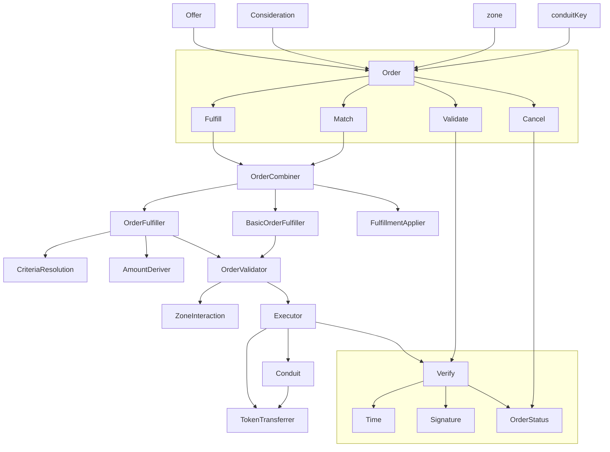

# Searport Analysis

## 概述

Seaport 的交易模型跟之前的 Wyvern Protocol 一样,依旧是中央订单簿的交易模型。都是由链下的中心化的订单簿和链上的交易组成。


其中链下的订单簿负责存储用户的挂单信息，并对订单进行撮合。最终的成交和转移 NFT 是由 Seaport Protocol 来负责的。

### 对比

我们都知道 Opensea 之前用的合约是 Wyvern Protocol。但是随着生态的发展 Wyvern Protocol 的各种问题开始暴露了出来。

1. 多年前开发的，代码最后维护的时间都是4年前了。
2. 不是专门为 Opensea 专门量身定做的，有大量的资源浪费。
3. gas 消耗多，280000左右（单个）。
4. 不支持直接使用代币购买 NFT，购买的时候需要转换。进一步提高了gas消耗和购买成本。

也正是为了解决这些问题 Seaport Protocol 被开发出来了。他有以下特性：

1. 支持批量购买，批量卖出。
2. 支持不同币种来购买。
3. 支持混合支付，比如订单可以设置成以一些 ERC20 代币加上某些 ERC721 代币来支付。主要目的是去除不同币种相互转换带来的损耗，进一步降低用户的额外费用。
4. 使用内联汇编来降低 gas 消耗，目前测试来看是 134000左右（单个）

我们可以看出 Seaport Protocol 最重要的目的就是降低用户的 gas 消耗并且降低购买流程的复杂度。

## 结构



上图是官方给出的结构解析图。

大致可以分为以下几个部分：

1. Order，订单相关数据结构
2. Order Fulfillment，订单撮合成交的方法
3. Verify，订单的校验
4. Transferrer，token 的转移

我们下面按照这个顺序来进行分析。

## Order

这里先分析 order 的数据结构，一些功能的具体实现后面再详细叙述。


### 1. offer 和 consideration

目前大多数 NFT 市场只允许一方同意提供 NFT，另一方同意提供支付代币的 listing。Seaport 采取了一种不同的方法：`offerer` 可以同意提供一定数量的 ETH/ERC20/ERC721/ERC1155 项目--这就是 `offer`。为了使该`offer`被接受，`offerer`必须收到一定数量的物品，这就是 `consideration`。

也就是说 Seaport 中没有明确的买家和卖家的概念了。

1. 当 offer 是 ERC721/ERC1155 的时候，offerer 就是卖家，卖出 ERC721/ERC1155 来换取 ETH/ERC20。
2. 当 offer 是 ETH/ERC20 的时候，offerer 就是买家，买入 ERC721/ERC1155，支付 ETH/ERC20。
3. 当 offer 和 consideration 都是 是 ERC721/ERC1155 的时候就是 NFT 的互换了，这种情况下就无所谓买家和卖家了。

需要注意的是 **ETH/ERC20 在 Seaport 中充当的是货币（currency），ERC721/ERC1155 充当的是商品。** 这一点很重要。

还有一点需要注意的是 order 中 offer 和 consideration 都是数组类型。数组的元素个数可以是 0 。也就是说 订单中 offer 或者 consideration 中的一个可以是空的。

```solidity
// ConsiderationStructs.sol => OfferItem

struct OfferItem {
    ItemType itemType;
    address token;
    uint256 identifierOrCriteria;
    uint256 startAmount;
    uint256 endAmount;
}

struct ConsiderationItem {
    ItemType itemType;
    address token;
    uint256 identifierOrCriteria;
    uint256 startAmount;
    uint256 endAmount;
    address payable recipient;
}
```

#### 1) itemType

```solidity
// ConsiderationEnums.sol => ItemType

enum ItemType {
    // 0: ETH on mainnet, MATIC on polygon, etc.
    NATIVE,

    // 1: ERC20 items (ERC777 and ERC20 analogues could also technically work)
    ERC20,

    // 2: ERC721 items
    ERC721,

    // 3: ERC1155 items
    ERC1155,

    // 4: ERC721 items where a number of tokenIds are supported
    ERC721_WITH_CRITERIA,

    // 5: ERC1155 items where a number of ids are supported
    ERC1155_WITH_CRITERIA
}
```

需要注意的是 ERC721_WITH_CRITERIA 和 ERC1155_WITH_CRITERIA。表示基于标准的 ERC721/ERC1155。

配合 identifierOrCriteria 可以用来表示一个标准，代表一个或者多个 NFT的集合。具体后面再来说明。

#### 2) token

token 的合约地址，空地址表示原生代币。

#### 3) identifierOrCriteria

对于 ETH/ERC20 类型的 token，这个属性会被忽略。

对于 ERC721/ERC1155 类型的项目，表示 token id。

对于 ERC721_WITH_CRITERIA/ERC1155_WITH_CRITERIA 类型的项目， 该值表示的是一个 merkle tree 的 root 值。这个 merkle tree 由一个指定的 token id 集合来生成。

简单来说就是卖家拥有一个 collection 的多个 NFT。这时候他就可以提供一个 offer，这个 offer 里的 identifierOrCriteria 是通过他所拥有的 NFT 对应的 token id 组成的集合生成的。这样这个 offer 就包含了他拥有的所有 NFT 对应的 token id 的信息。买家在交易的时候可以选择某一个 token id 的 NFT 进行交易，如果验证通过就能进行成交。具体实现过程后面再详细说明。

identifierOrCriteria 可以为 0，表示买家提供该 collection 下所有 NFT 的 offer。买家在成交的时候可以选择任意一个。

需要注意的是，这个特性在 Opensea 目前的前端界面中还不支持。

#### 4) startAmount 和 endAmount

普通情况下这两个值是相同的。表示 token 的数量。

在进行荷兰式拍卖和英格兰式拍卖的时候，这两个值是不同的。然后订单根据当前这个两个属性并结合当前区块时间以及订单的 startTime、endTime 来确定当前的价格。

```solidity
// AmountDeriver.sol =>  _locateCurrentAmount()

// Derive the duration for the order and place it on the stack.
duration = endTime - startTime;

// Derive time elapsed since the order started & place on stack.
elapsed = block.timestamp - startTime;

// Derive time remaining until order expires and place on stack.
remaining = duration - elapsed;
```

#### 5) recipient

consideration 需要指明 recipient。代表 token 的接收地址。

### 2. offerer

order 里的 offer 的提供者。

需要注意的是，订单要是想要成交或者说想要转移 offerer 提供的 offer，必须是下面三个情况中的一个。

1. msg.sender == offerer，也就是卖家自己操作
2. 通过签名进行授权，标准的 65-byte EDCSA, 64-byte EIP-2098, 或者通过 EIP-1271 isValidSignature 的校验。大部分情况下是这种。
3. offerer 通过调用 validate() 进行链上挂单的。这种情况下订单成交的时候可以跳过签名的校验。

```solidity
// Consideration.sol => validate()

function validate(Order[] calldata orders)
        external
        override
        returns (bool validated)
    {
        // Validate the orders.
        validated = _validate(orders);
    }
```

### 3. startTime 和 endTime

订单的开始和结束时间。还可以配合 offer 或者 consideration 的 startAmount/endAmount 来确定拍卖的价格。

### 4. orderType

订单有四种类型，是两种类型选项的组合。

#### 1) FULL 和 PARTIAL

`FULL` 表示订单不支持部分填充，而 `PARTIAL` 允许填充订单的某些部分，但需要注意的是，每个项目必须可以被提供的部分完全整除（即除后没有余数）。部分填充一般用于 ERC1155 的 NFT。买方可以购买 offer 中的一部分。

#### 2) OPEN 和 RESTRICTED

`OPEN` 表示执行订单的调用可以由任何帐户提交，而 `RESTRICTED` 是限制性的订单，要求由 offerer 或订单 zone 执行订单，或者调用 zone 的 `isValidOrder`或 `isValidOrderIncludingExtraData` 方法来查看返回的 magic value。这个 magic value 表示订单是否已被批准。

```solidity
// ConsiderationEnums.sol => OrderType

enum OrderType {
    // 0: no partial fills, anyone can execute
    FULL_OPEN,

    // 1: partial fills supported, anyone can execute
    PARTIAL_OPEN,

    // 2: no partial fills, only offerer or zone can execute
    FULL_RESTRICTED,

    // 3: partial fills supported, only offerer or zone can execute
    PARTIAL_RESTRICTED
}
```

### 5. zone

zone 是可选的辅助帐户，一般情况下是一个合约。

具有两个附加权限：

1. zone 可以通过调用 `cancel` 来取消其命名为区域的订单。（请注意，offerer 也可以取消自己的订单，可以单独取消，也可以通过调用 `incrementCounter` 立即取消与当前计数器签署的所有订单）。
2. `RESTRICTED` 类型的订单必须由 zone 或 offerer 执行，或者调用 zone 的 `isValidOrder`或 `isValidOrderIncludingExtraData` 方法来查看返回的 magic value。这个 magic value 表示订单是否已被批准。

简单来说 zone 是在成单前做额外校验的，并且可以取消 offerer 的 listing。offerer 可以利用 zone 来做一些交易过滤相关的操作。

### 6. zoneHash

zoneHash 代表一个任意的 32 字节的值，在履行限制性订单时，该值将被提供给 zone ，zone 在决定是否授权该订单时可以利用该值。

### 7. conduitKey

conduitKey 是一个 bytes32 的值，表示在执行代币转移时，应该利用什么 conduit（渠道） 作为代币批准的来源。默认情况下（即当 conduitKey 被设置为0时），offerer 将直接向 Seaport 授权 ERC20、ERC721和ERC1155代币，这样它就可以在执行期间执行订单指定的转移。相反，offerer 将代币批准给对应的 conduit，然后 Seaport 将指示该 conduit 转移各自的代币。

conduitKey 跟 conduit 是密切关联的。项目方，拥有者或者平台可以通过 conduit 来管理 nft 的交易。提供了更大的灵活性。

### 8. counter

计数器，要与 offerer 的计数器相同。

## Order Fulfillment

在 Wyvern Protocol 中所有的订单都是通过 `orderMatch` 方法来最终成交的。Seaport 与之不同，提供了 7 个方法来执行交易。

这些方法可以分为两类：

### fulfill

包括所有以 fulfill 开头的方法。

1. fulfillBasicOrder                    => 0xfb0f3ee1
2. fulfillOrder                         => 0xb3a34c4c
3. fulfillAdvancedOrder                 => 0xe7acab24
4. fulfillAvailableOrders               => 0xed98a574
5. fulfillAvailableAdvancedOrders       => 0x87201b41

调用这些方法的时候，第二个隐含订单将被构建，调用者为 offerer，将要履行的订单的 offer 为 consideration，将要履行订单的 consideration 为 offer。将要履行订单的 offer 项目将从订单的 offerer 转移到履行者，然后所有 consideration 项目将从履行者转移到指定的接受者。

目前大部分成交都调用的这些方法。

### match

包括 match 开头的方法。

1. matchOrders                  => 0xa8174404
2. matchAdvancedOrders          => 0x55944a42

这些方法将多个订单（大于等于 2）匹配起来，Seaport 将简单地确保每个订单的需求重合。

以这种方式履行的订单没有一个明确的履行者。交易成功的事件中 recipient 为空。

目前发现的有两种使用场景：

1. 在挂单的时候指定某个地址购买。这个指定的地址在购买的时候。
2. 在某个 NFT 的 offer 列表里点击 counter 进行议价的时候。

后面应该会有更多的使用场景。

### Advanced

Advanced 分两个维度

一个是订单：订单分为 Order / AdvancedOrder

二是方法：方法也有 普通方法 和 Advanced 方法

总结下来 Advanced 主要体现在下面几点：

#### 1. 部分填充(Partial fills)

上面我们了解到 orderType 中有 FULL 和 PARTIAL 的分别。 FULL 表示完全填充，也就是买方必须购买全部的 offer。 PARTIAL 则表示允许买方购买部分的 offer。

因此在使用部分填充的时候 orderType 必须是 1 或者 3。

AdvancedOrder 相较于 Order 多了 numerator（分子）和 denominator（分母）两个参数。通过他们计算出来一个比率，这个比率就是买方希望获取数量占 offer 总数量的百分比。分子、分母都是 1 则表示要全部购买。（其实在 Advanced 的方法中 Order 都会被转化为 AdvancedOrder，分子、分母都是 1）

一个 offer 支持多次填充。也就是说如果一次交易没有完全卖出，订单还是有效的。后续还可以进行购买。

#### 1. criteriaResolvers

#### 2. 

#### 1. 可以指定 recipient

fulfillOrder 和 fulfillAvailableOrders 方法只能指定 `msg.sender` 作为 recipient。Advanced Order 可以指定任意的 recipient。

#### 2. 

```solidity
function fulfillBasicOrder(
    parameters(
        address considerationToken, 
        uint256 considerationIdentifier, 
        uint256 considerationAmount, 
        address offerer, 
        address zone, 
        address offerToken, 
        uint256 offerIdentifier, 
        uint256 offerAmount, 
        uint8 basicOrderType, 
        uint256 startTime, 
        uint256 endTime, 
        bytes32 zoneHash, 
        uint256 salt, 
        bytes32 offererConduitKey, 
        bytes32 fulfillerConduitKey, 
        uint256 totalOriginalAdditionalRecipients, 
        additionalRecipients(
            uint256 amount, 
            address recipient
            )[] , 
        bytes signature
        ) 
    ) 
    
    payable 
    
    returns (bool fulfilled)
```

```solidity
function fulfillOrder(
    order(
        parameters(
            address offerer, 
            address zone, 
            offer(
                uint8 itemType, 
                address token, 
                uint256 identifierOrCriteria, 
                uint256 startAmount, 
                uint256 endAmount
            )[] , 
            consideration(
                uint8 itemType, 
                address token, 
                uint256 identifierOrCriteria, 
                uint256 startAmount, 
                uint256 endAmount, 
                address recipient
            )[] , 
            uint8 orderType, 
            uint256 startTime, 
            uint256 endTime, 
            bytes32 zoneHash, 
            uint256 salt, 
            bytes32 conduitKey, 
            uint256 totalOriginalConsiderationItems
        ) , 
        bytes signature
    ) , 
    bytes32 fulfillerConduitKey
    ) 
    
    payable 
    
    returns (bool fulfilled)
```

```solidity
function fulfillAdvancedOrder(
    advancedOrder(
        parameters(
            address offerer,
            address zone,
            offer(
                uint8 itemType,
                address token,
                uint256 identifierOrCriteria,
                uint256 startAmount,
                uint256 endAmount
            )[],
            consideration(
                uint8 itemType,
                address token,
                uint256 identifierOrCriteria,
                uint256 startAmount,
                uint256 endAmount,
                address recipient
            )[],
            uint8 orderType,
            uint256 startTime,
            uint256 endTime,
            bytes32 zoneHash,
            uint256 salt,
            bytes32 conduitKey,
            uint256 totalOriginalConsiderationItems
        ),
        uint120 numerator, // 分子
        uint120 denominator, // 分母
        bytes signature,
        bytes extraData
    ),
    criteriaResolvers(
        uint256 orderIndex,
        uint8 side,
        uint256 index,
        uint256 identifier,
        bytes32[] criteriaProof
    )[],
    bytes32 fulfillerConduitKey,
    address recipient
)

payable

returns(bool fulfilled)
```

```solidity

function fulfillAvailableOrders(
    orders(
        parameters(
            address offerer, 
            address zone, 
            offer(
                uint8 itemType, 
                address token, 
                uint256 identifierOrCriteria, 
                uint256 startAmount, 
                uint256 endAmount
                )[] , 
            consideration(
                uint8 itemType, 
                address token, 
                uint256 identifierOrCriteria, 
                uint256 startAmount, 
                uint256 endAmount, 
                address recipient
                )[] , 
            uint8 orderType, 
            uint256 startTime, 
            uint256 endTime, 
            bytes32 zoneHash, 
            uint256 salt, 
            bytes32 conduitKey, 
            uint256 totalOriginalConsiderationItems
            ) , 
        bytes signature
        )[] , 
    offerFulfillments(
        uint256 orderIndex, 
        uint256 itemIndex
        )[][] , 
    considerationFulfillments(
        uint256 orderIndex, 
        uint256 itemIndex
        )[][] , 
    bytes32 fulfillerConduitKey, 
    uint256 maximumFulfilled
    ) 
    
    payable 
    
    returns (
        bool[] availableOrders, 
        executions(
            item(
                uint8 itemType, 
                address token, 
                uint256 identifier, 
                uint256 amount, 
                address recipient
                ) , 
            address offerer, 
            bytes32 conduitKey
            )[] 
        )
```

```solidity
function fulfillAvailableAdvancedOrders(
    advancedOrders(
        parameters(
            address offerer,
            address zone,
            offer(
                uint8 itemType,
                address token,
                uint256 identifierOrCriteria,
                uint256 startAmount,
                uint256 endAmount
            )[],
            consideration(
                uint8 itemType,
                address token,
                uint256 identifierOrCriteria,
                uint256 startAmount,
                uint256 endAmount,
                address recipient
            )[],
            uint8 orderType,
            uint256 startTime,
            uint256 endTime,
            bytes32 zoneHash,
            uint256 salt,
            bytes32 conduitKey,
            uint256 totalOriginalConsiderationItems
        ),
        uint120 numerator,
        uint120 denominator,
        bytes signature,
        bytes extraData
    )[],
    criteriaResolvers(
        uint256 orderIndex,
        uint8 side,
        uint256 index,
        uint256 identifier,
        bytes32[] criteriaProof
    )[],
    offerFulfillments( // 所有的提供详情：根据地址划分
        uint256 orderIndex,
        uint256 itemIndex
    )[][],
    considerationFulfillments( // 所有的收取详情：根据地址划分
        uint256 orderIndex,
        uint256 itemIndex
    )[][],
    bytes32 fulfillerConduitKey,
    address recipient,
    uint256 maximumFulfilled
)

payable

returns(
    bool[] availableOrders,
    executions(
        item(
            uint8 itemType,
            address token,
            uint256 identifier,
            uint256 amount,
            address recipient
        )[],
        address offerer,
        bytes32 conduitKey
    )
)
```
<!--  -->
